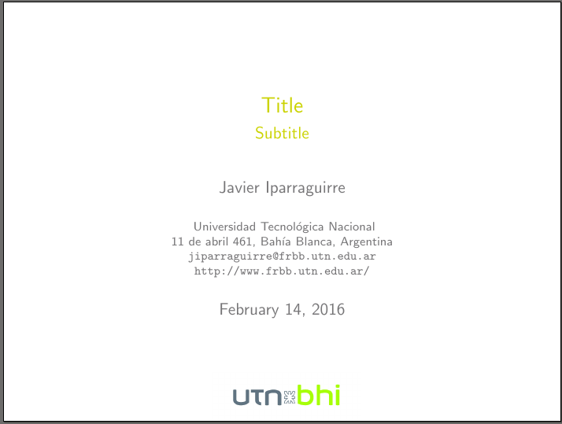

# Custom Beamer Template
Custom Beamer template that follows UTN BHI design.

## Compile instructions
The file main.tex is the start point. If you are using a Linux-based machine, open a terminal and type:

    sh run.sh

If the compilation was successful, you will see a file called **main.pdf**.