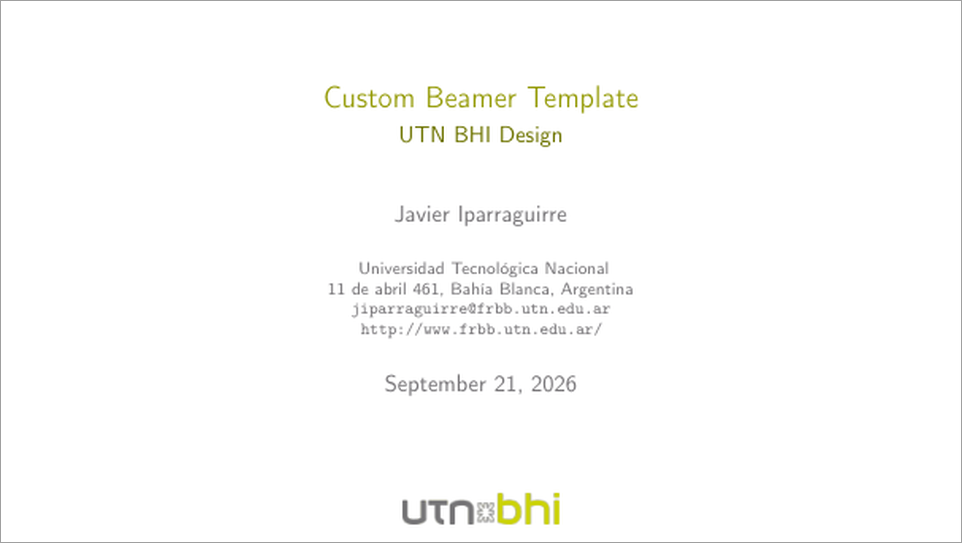

# Custom Beamer Template

Beamer theme following UTN BHI (Universidad Tecnológica Nacional - Bahía Blanca)
design guidelines. See [CHANGELOG.md](CHANGELOG.md) for what changed between
releases; v2.0.0 is a breaking release and lists the migration steps.



## Build

```sh
sh run.sh
```

Produces `output/main.pdf`. Uses `latexmk` when available, otherwise three
`pdflatex` passes plus `bibtex`. To build another file: `sh run.sh slides`.

### On Windows (WSL)

`run.sh` needs a POSIX shell, so build from WSL rather than PowerShell:

```powershell
wsl sh run.sh
```

One-time setup inside WSL (Ubuntu):

```sh
sudo apt update
sudo apt install -y texlive-latex-recommended texlive-latex-extra \
                    texlive-fonts-recommended texlive-bibtex-extra latexmk
```

The repository can live on the Windows drive; WSL reaches it under
`/mnt/c/...`. Open the PDF with `explorer.exe output/main.pdf`.

### Requirements

`pdflatex` and `bibtex`, plus the packages `beamer`, `graphicx`, `xcolor`,
`booktabs`, `listings`, `microtype`, `amsmath`, `amsfonts`, `amssymb`, `url`.

## Using the theme

```latex
\usetheme{UTN-BHI}
\usetheme[listings]{UTN-BHI}
```

| Option | Effect |
| --- | --- |
| `listings` | Loads `listings` and defines `\lstdefinestyle{utnbhi}`. Without it the theme pulls in nothing extra. |
| `nologo` | Draws no logo, but still reserves its space. |
| `nobrandfont` | Keeps Beamer's default sans instead of the institutional Arial/Helvetica. |
| `classicgreen` | Restores the original `#CBD300` frame titles (1.63:1 — unreadable on a projector). |

`\utnbhinologo` hides the logo for the rest of the current group without
changing the text area, so slides do not shift:

```latex
{ \utnbhinologo \begin{frame} ... \end{frame} }
```

`\utnbhilogowidth` sets the width of the isologotipo itself (default `3cm`, the
minimum of §2.6). The image drawn is wider, because the reserve area travels
inside the master's frame — see *Brand compliance*.

With the `listings` option, apply the bundled style:

```latex
\lstset{style=utnbhi, language=C}
```

Set the aspect ratio on the document class: `\documentclass[aspectratio=169]{beamer}`
(the default here) or `aspectratio=43`. The theme looks the same in both.

## Using the theme from another project

Assets are found through `\utnbhiassetpath`, which defaults to `theme/`. You do
not have to copy files into your own project — put the checkout on `TEXINPUTS`:

```sh
TEXINPUTS="./custom-beamer:$TEXINPUTS" pdflatex slides.tex
```

The trailing entry separator matters (`:` on Unix, `;` on Windows). To point
only the assets somewhere else, define the path before `\usetheme`:

```latex
\providecommand{\utnbhiassetpath}{../custom-beamer/theme/}
```

## Brand compliance

The theme follows the *Manual de Identidad Visual Institucional* (UTN-FRBB,
FEB 2014). Section references below are to that document.

**The logo (§2.1–2.6).** `theme/utn_bhi_isologotipo.jpg` is the designer's
master, committed unmodified. It is CMYK, so it cannot go into a deck as-is:
`pdflatex` embeds it as DeviceCMYK and an uncolour-managed viewer renders it
`#A6FF07 / #4F6675` instead of the brand colours. `theme/make-logo.py`
separates the two inks and repaints them at the RGB values §2.8 gives,
producing the sRGB `theme/utn-bhi-logo.png` the theme actually draws.
Proportions, composition and colours are untouched (§2.5).

The master's own frame already carries the *área de protección* of §2.3 —
1.05a above, 1.22a below and 1.69a at the sides, where *a* is the height of the
arañita. The theme draws that whole frame and never crops it, and because the
logo lives in the footline, Beamer subtracts its height from `\textheight`, so
slide text cannot enter the reserve. Default width is the 3 cm minimum of §2.6.

**Typography (§3.2).** Arial is the institutional complementary alphabet, so
the theme loads `helvet` (Nimbus Sans — metrically compatible with Helvetica
and therefore Arial, and present in every TeX Live). Pass `nobrandfont` to opt
out. The Kabegnos alphabet of §3.1 is reserved for the logo and is not used.

## Colours

§2.8 fixes the two institutional colours and gives their RGB values for
non-print media, which is what a projected deck is:

| Ink | CMYK | RGB |
| --- | --- | --- |
| Pantone 382 | 29 / 0 / 100 / 0 | `#CBD300` |
| Pantone Cool Gray 9 | 58 / 49 / 43 / 11 | `#767577` |

Both are used unaltered as `greenUTN` and `grayUTN`. But `#CBD300` measures
**1.63:1** against white, where WCAG asks 4.5:1 for body text and 3:1 for large
text — up to v1.x it coloured every frame title, which is why titles washed out
on a projector. It is now an accent only, and text uses darker tints of the same
two hues. The §2.5 prohibition on changing the institutional colours applies to
the isologotipo, which this theme never recolours.

| Colour | Hex | On white | Used for |
| --- | --- | --- | --- |
| `greenUTN` | `#CBD300` | 1.63:1 | accent: bullets, logo |
| `greenUTNtitle` | `#929800` | 3.13:1 | frame titles, title page (large text) |
| `greenUTNdark` | `#6F7500` | 4.98:1 | subtitle, captions, toc, code keywords |
| `grayUTN` | `#767577` | 4.58:1 | body text |
| `grayUTNdark` | `#5A5A5C` | 6.88:1 | text on tints (blocks, code) |
| `alertUTN` | `#A03000` | 7.20:1 | `\alert`, alert blocks, code strings |

`greenUTNtitle` is the brightest point on the logo's own hue that still clears
3:1, so titles stay brand green instead of going olive. Verify the palette with
`python3 theme/check-contrast.py`.

## Layout

| File | Role |
| --- | --- |
| `main.tex` | Sample deck — start here |
| `beamerthemeUTN-BHI.sty` | The theme |
| `references.bib` | Bibliography |
| `run.sh` | Build script |
| `theme/utn_bhi_isologotipo.jpg` | **Master logo**, from the designer. CMYK, unmodified. Do not edit |
| `theme/utn-bhi-logo.png` | sRGB screen asset derived from the master; this is what the theme draws |
| `theme/make-logo.py` | Regenerates the screen asset from the master (needs Pillow + NumPy) |
| `theme/check-contrast.py` | Checks the palette against WCAG |

## Troubleshooting

- Compilation fails — read `output/main.log`
- `File 'theme/utn-bhi-logo' not found` — compiling from another directory; see
  *Using the theme from another project*
- `File 'theme/utn-bhi-page{,-blank}.png' not found` — those backgrounds were
  superseded by the designer's master logo and removed. A deck that wrapped
  frames in `\usebackgroundtemplate{...utn-bhi-page-blank.png}` to hide the
  logo should use `\utnbhinologo` instead; one that used `utn-bhi-page.png`
  should just drop the `\usebackgroundtemplate` line, since the theme now
  draws the logo itself
- Text overlapping the logo — you are on v1.x, or you have overridden the
  `footline` template; the theme reserves the logo's space itself
- `run.sh: not found` or `\r` errors in WSL — the file must keep LF line endings

## Author

Javier Iparraguirre  
Universidad Tecnológica Nacional - Bahía Blanca  
<jiparraguirre@frbb.utn.edu.ar>

Licensed GPL-3.0-or-later.
